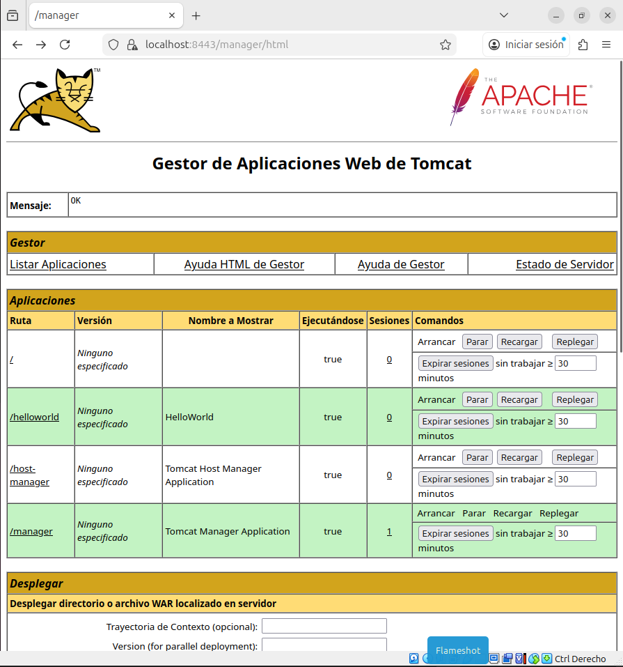
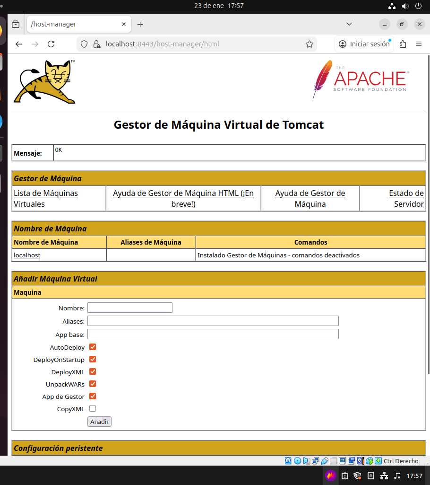

# Interfaces Manager y Host Manager en Apache Tomcat

Apache Tomcat dispone de dos interfaces web de administración que permiten gestionar aplicaciones y hosts de forma sencilla desde el navegador: **Manager** y **Host Manager**.

---

## Acceso a las interfaces

Ambas interfaces se acceden desde un navegador web, normalmente usando el puerto 8080:

- **Manager**  
  `http://localhost:8080/manager/html`

- **Host Manager**  
  `http://localhost:8080/host-manager/html`

Para poder acceder es necesario disponer de un usuario con los roles adecuados definidos en el archivo `tomcat-users.xml`.

---

## Interfaz Manager

La interfaz **Manager** permite administrar aplicaciones web desplegadas en el servidor Tomcat.

### Funciones principales

- **Despliegue de aplicaciones**  
  Permite desplegar aplicaciones web en formato `.war` o desde un directorio local o remoto.

- **Recarga de aplicaciones**  
  Reinicia una aplicación concreta sin necesidad de reiniciar todo el servidor Tomcat.

- **Parada y arranque de aplicaciones**  
  Permite detener o iniciar aplicaciones web de forma individual.

- **Eliminación de aplicaciones**  
  Borra aplicaciones desplegadas desde la interfaz.

---

### Ficha descriptiva – Manager

- **Nombre:** Manager Web Application  
- **Ruta de acceso:** `/manager/html`  
- **Función principal:** Gestión de aplicaciones web  
- **Acciones disponibles:**  
  - Desplegar aplicaciones  
  - Recargar aplicaciones  
  - Parar y arrancar aplicaciones  
  - Eliminar aplicaciones  
- **Rol necesario:** `manager-gui`  

---

## Interfaz Host Manager

La interfaz **Host Manager** se utiliza para administrar los **hosts virtuales** de Tomcat.

### Funciones principales

- **Creación de hosts virtuales**  
  Permite crear nuevos hosts virtuales sin editar manualmente los archivos de configuración.

- **Eliminación de hosts**  
  Borra hosts virtuales existentes.

- **Gestión de dominios**  
  Facilita la configuración de múltiples dominios o aplicaciones en un mismo servidor Tomcat.

---

### Ficha descriptiva – Host Manager

- **Nombre:** Host Manager Web Application  
- **Ruta de acceso:** `/host-manager/html`  
- **Función principal:** Gestión de hosts virtuales  
- **Acciones disponibles:**  
  - Crear hosts virtuales  
  - Eliminar hosts virtuales  
  - Configurar dominios  
- **Rol necesario:** `admin-gui`  

---

## Conclusión

Las interfaces **Manager** y **Host Manager** facilitan enormemente la administración de Apache Tomcat desde un entorno gráfico, permitiendo gestionar aplicaciones y hosts sin necesidad de reiniciar el servidor ni modificar archivos manualmente, siempre que se cuente con los permisos adecuados.
