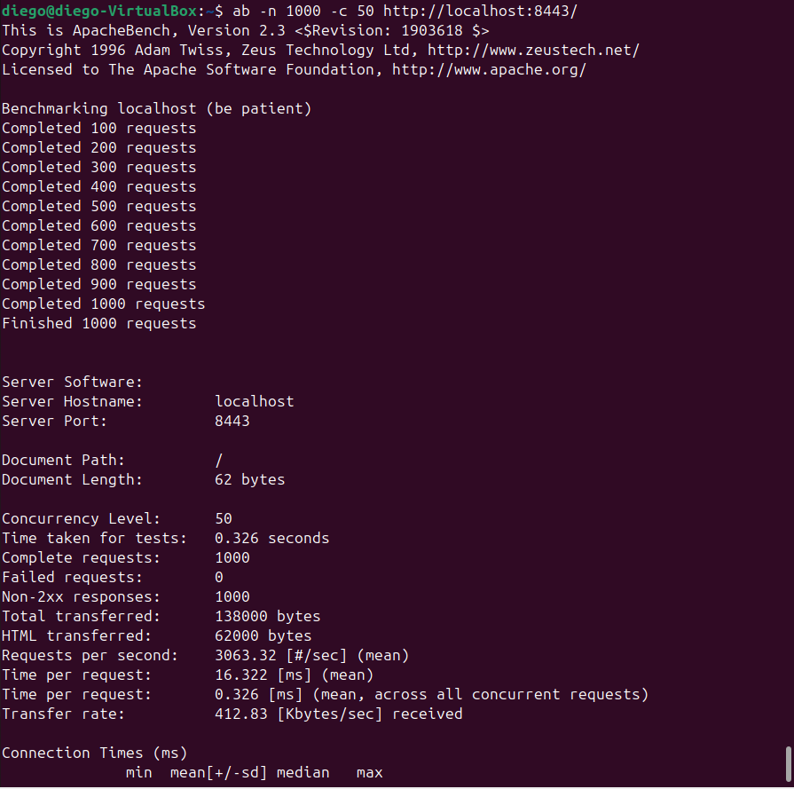
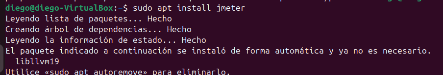
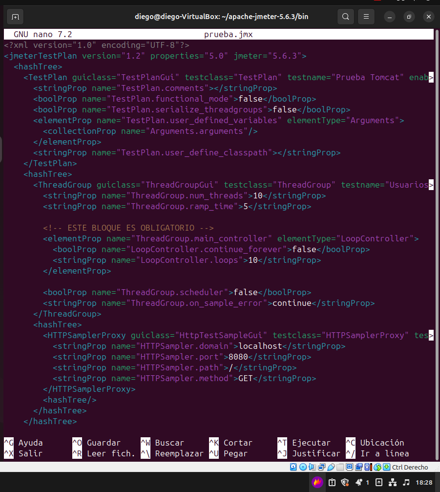
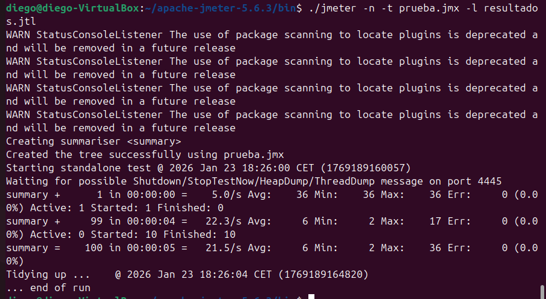
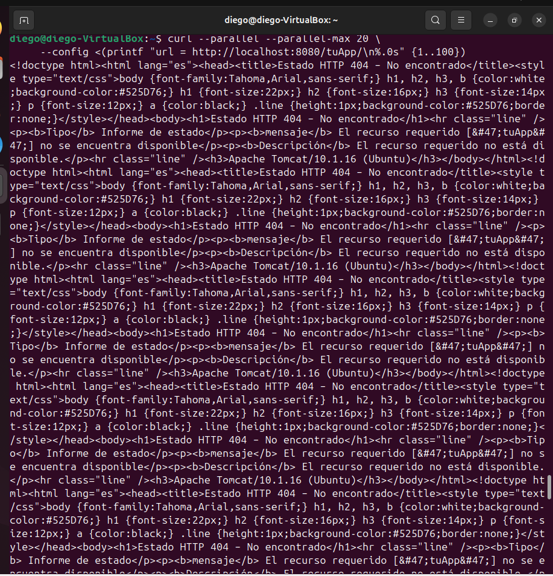
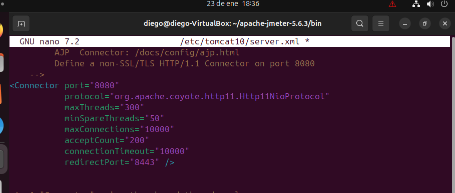
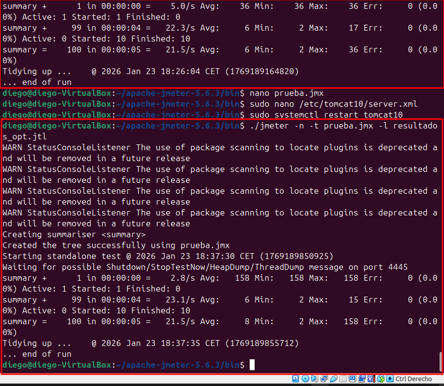

# Pruebas de carga y ajuste de rendimiento en Apache Tomcat

Para evaluar el rendimiento de una aplicación desplegada en Apache Tomcat, se pueden utilizar distintas herramientas de prueba de carga. Estas permiten simular múltiples peticiones simultáneas y analizar el comportamiento del servidor bajo estrés.

---

## Herramientas utilizadas

### ApacheBench (ab)

ApacheBench es una herramienta de línea de comandos incluida con Apache que permite realizar pruebas de carga simples y rápidas.

- Simula múltiples peticiones concurrentes
- Mide tiempo de respuesta y peticiones por segundo
- Ideal para pruebas rápidas

Ejemplo de uso:

**ab -n 1000 -c 100 http://localhost:8443/**

---

### JMeter

Apache JMeter es una herramienta gráfica más avanzada, orientada a pruebas de carga y rendimiento.

- Permite crear planes de prueba complejos
- Simula múltiples usuarios concurrentes
- Genera informes detallados de rendimiento

Se configura mediante una interfaz gráfica o creando un archivo de prueba .jmx a mano donde se definen usuarios, peticiones y tiempos de espera.

Instalamos la herramienta

Creamos el archivo de prueba

y hacemos la prueba

---

### curl --parallel

La opción `--parallel` de curl permite realizar varias peticiones HTTP simultáneas desde consola.

- Herramienta ligera
- Útil para pruebas básicas de concurrencia
- No requiere configuración adicional

Ejemplo de uso:

**curl --parallel --parallel-immediate http://localhost:8080**

---

## Ejecución de pruebas de carga

Se ejecutaron pruebas de carga sobre la aplicación desplegada en Tomcat utilizando las herramientas mencionadas, simulando múltiples usuarios accediendo al servicio de forma simultánea.

Durante las pruebas se observaron los tiempos de respuesta, el número de peticiones atendidas y el comportamiento del servidor bajo carga.

---

## Registro de resultados

Los resultados obtenidos incluyeron:

- Tiempo medio de respuesta
- Número de peticiones por segundo
- Errores producidos durante la carga
- Consumo de recursos del servidor

Estos datos permitieron identificar posibles cuellos de botella.

---

## Ajustes en `server.xml`

Tras analizar los resultados, se realizaron ajustes en el archivo `server.xml`, modificando parámetros como:

- Número de hilos (`maxThreads`)
- Número máximo de conexiones (`maxConnections`)
- Tiempo de espera (`connectionTimeout`)

Estos cambios permitieron optimizar la gestión de peticiones concurrentes.

---

## Comparación de rendimiento

### Antes de los ajustes

- Mayor tiempo de respuesta
- Menor capacidad de concurrencia
- Aparición de errores bajo carga elevada

### Después de los ajustes

- Reducción del tiempo de respuesta
- Mejor manejo de peticiones simultáneas
- Mayor estabilidad del servidor

---

## Conclusión

El uso de herramientas de prueba de carga junto con el ajuste de parámetros en `server.xml` permite mejorar significativamente el rendimiento de Apache Tomcat, garantizando una mejor experiencia de usuario y una mayor estabilidad del sistema.
