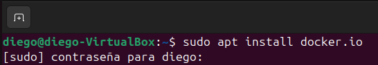
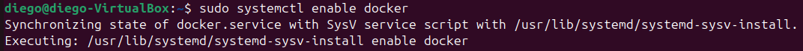
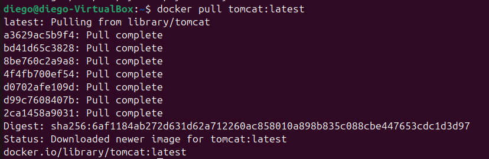
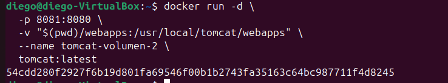

# 📦 Uso de Apache Tomcat con Docker

## 0. ¿Qué es Docker?
**Docker** es una plataforma que permite ejecutar aplicaciones dentro de contenedores que ya traen incorporado todo lo necesario:

- La propia aplicación  
- Sus dependencias  
- El sistema de ejecución  

Gracias a Docker, Tomcat puede funcionar sin instalarse directamente en el equipo.

---

## 1. Instalación de Docker
Comprobamos si Docker está disponible con:

`docker --version`

Si no lo está, lo instalamos con:

---

## 2. Descargar la imagen oficial de Tomcat
Descargamos desde Docker Hub la imagen más reciente de Tomcat:

---

## 3. Ejecutar Tomcat en un contenedor
Lanzamos el contenedor montando un volumen para poder modificar la aplicación sin tener que recrearlo:

Si el puerto 8080 ya está en uso por otra instancia local de Tomcat, será necesario asignar otro puerto en el host.

---

## 4. Diferencias entre Tomcat instalado y Tomcat en Docker

### Tomcat instalado en el sistema
- Se integra directamente con el sistema operativo  
- Usa librerías del propio sistema  
- Necesita configuración manual (Java, rutas, variables)  
- Es más difícil de clonar en otros equipos  
- Puede dejar archivos residuales  

### Tomcat ejecutado en Docker
- No requiere instalar Tomcat ni Java en el host  
- Funciona en un entorno aislado  
- Se puede reproducir fácilmente en cualquier equipo  
- Despliegue rápido y portable  
- Fácil de eliminar y volver a crear  
- Perfecto para pruebas, CI/CD y entornos cloud  
- Puede tener una ligera sobrecarga  
- Para conservar datos se necesitan volúmenes  

---

## 5. Conclusión
Docker permite trabajar con Tomcat de forma más sencilla, limpia y portable, ofreciendo un entorno controlado, reproducible y escalable frente a la instalación tradicional.
