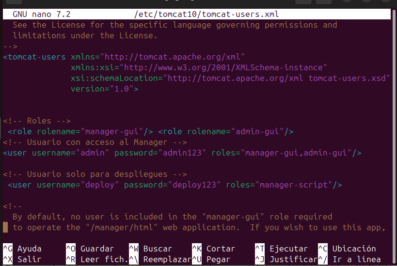
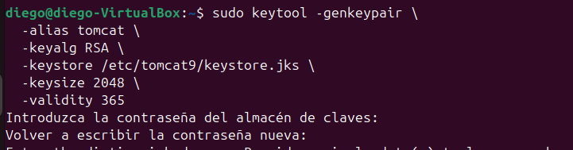
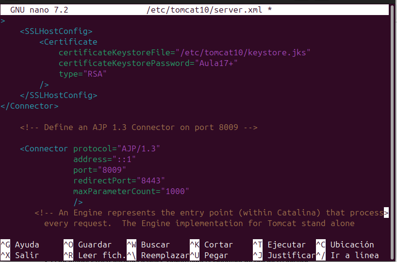
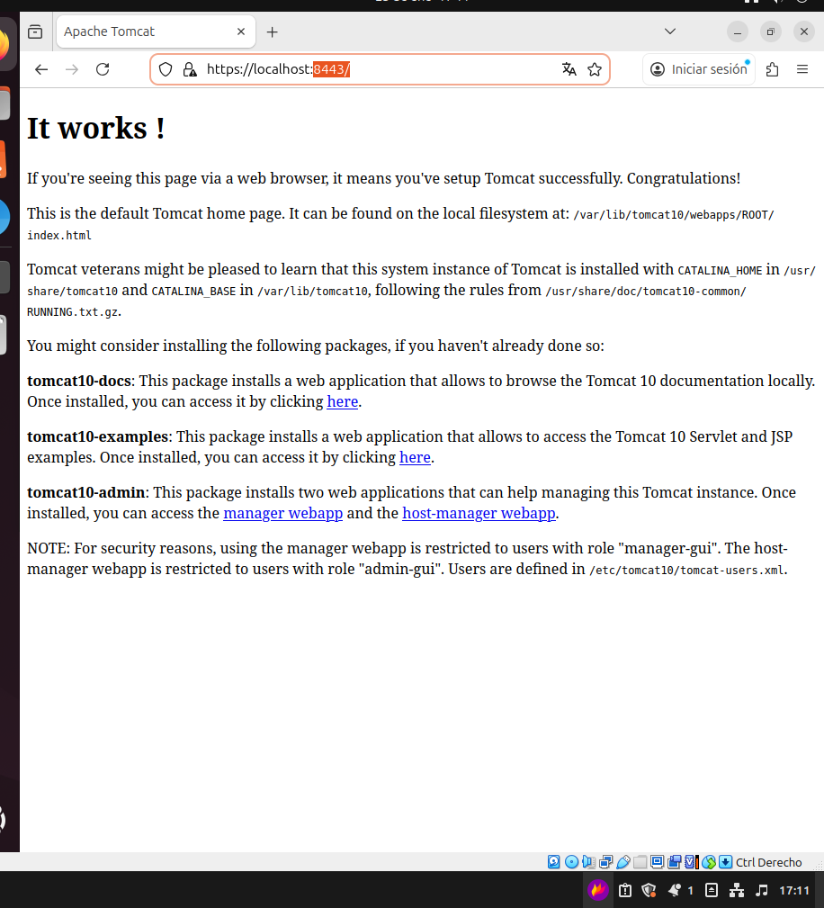
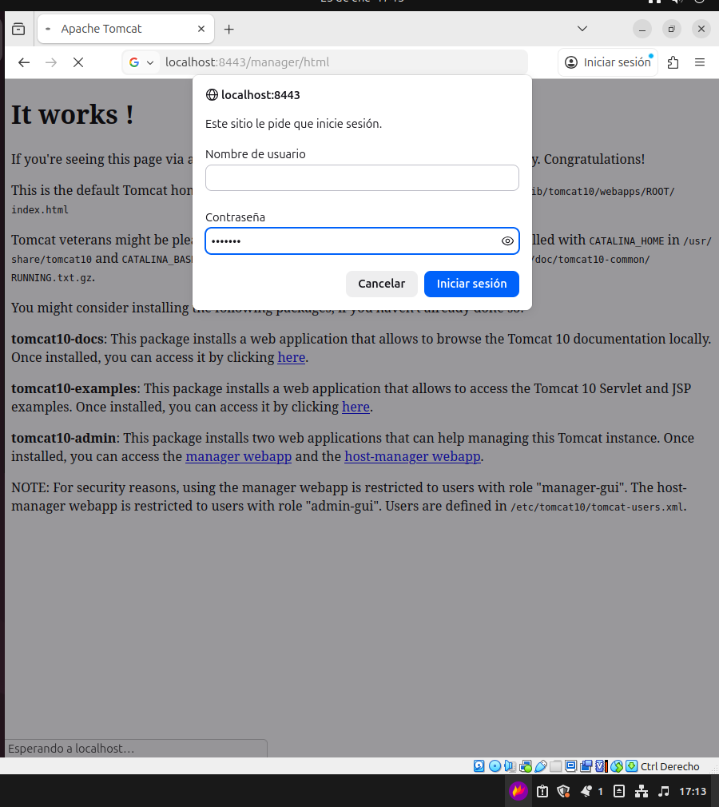
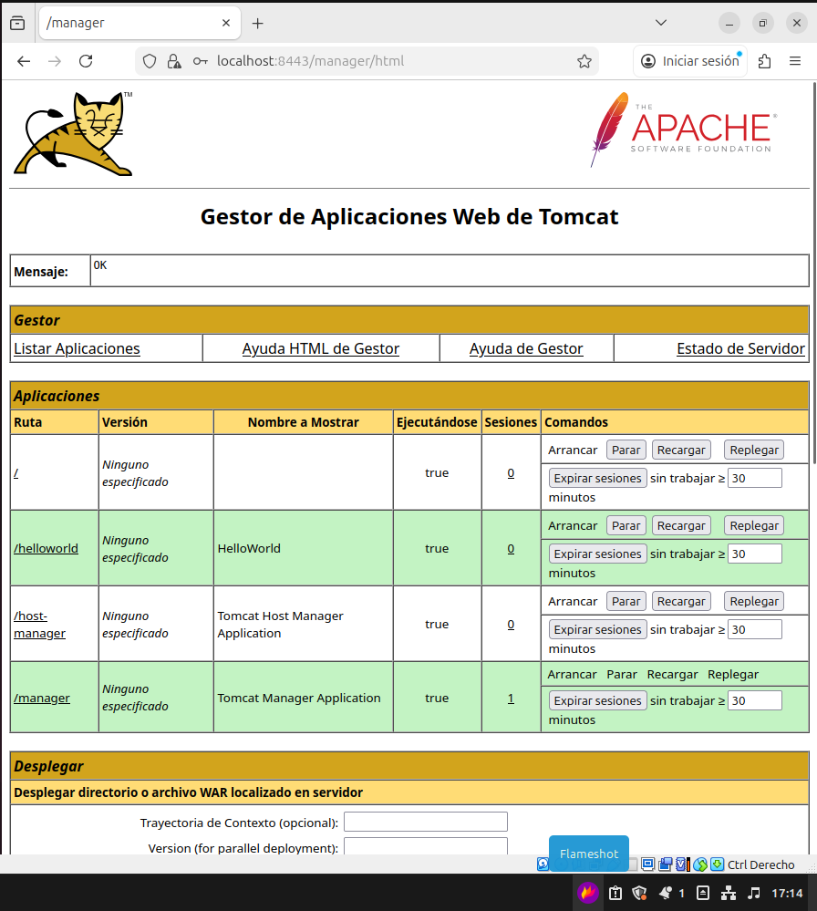
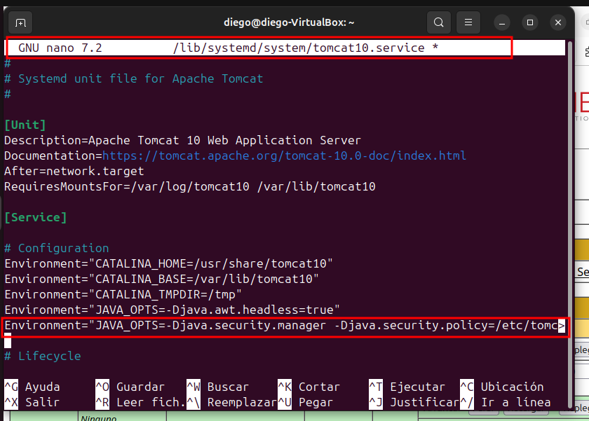
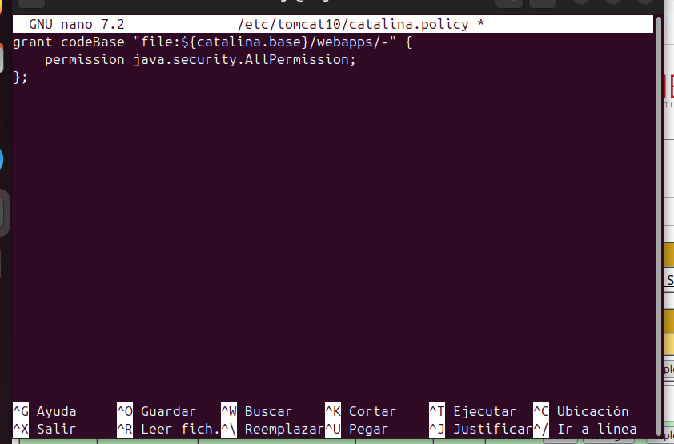

# Configuración de seguridad en Apache Tomcat 10 (Ubuntu 24.04)

Este documento explica cómo asegurar un servidor Tomcat 10 en Ubuntu 24.04 mediante:

1. Definir roles y usuarios en `tomcat-users.xml`  
2. Restringir el acceso al Manager por IP  
3. Configurar HTTPS con un keystore y un conector SSL  
4. Activar el Security Manager  

---

## 1. Definir roles y usuarios en `tomcat-users.xml`

El archivo se encuentra en:

`/etc/tomcat10/tomcat-users.xml`

Añadimos los roles y usuarios necesarios:

Y reiniciamos tomcat10.

---

## 2. Restringir el acceso al Manager

El Manager WebApp tiene un filtro de IP configurado en:

`/usr/share/tomcat10-admin/manager/META-INF/context.xml`

En el archivo incluimos la línea:

Esto permite el acceso desde cualquier IP del rango 127.x.x.x.  
Después de esto reiniciamos tomcat10.

---

## 3. Configurar HTTPS con un keystore y un conector SSL

Creamos el keystore y le damos una contraseña para el almacén de claves:

Le damos permisos:

**sudo chown tomcat:tomcat /etc/tomcat10/keystore.jks**  
**sudo chmod 600 /etc/tomcat10/keystore.jks**

Ahora en el archivo `server.xml` añadimos el siguiente bloque:

Reiniciamos tomcat y hacemos una prueba en el navegador.

---

Y probamos si hemos restringido el acceso al manager y si se puede acceder con la contraseña que hemos puesto en el archivo `tomcat-users.xml`.

---

## 4. Activar Security Manager

Entramos al archivo de service y añadimos lo siguiente:

Después creamos el archivo de `catalina.policy` y añadimos lo siguiente.

