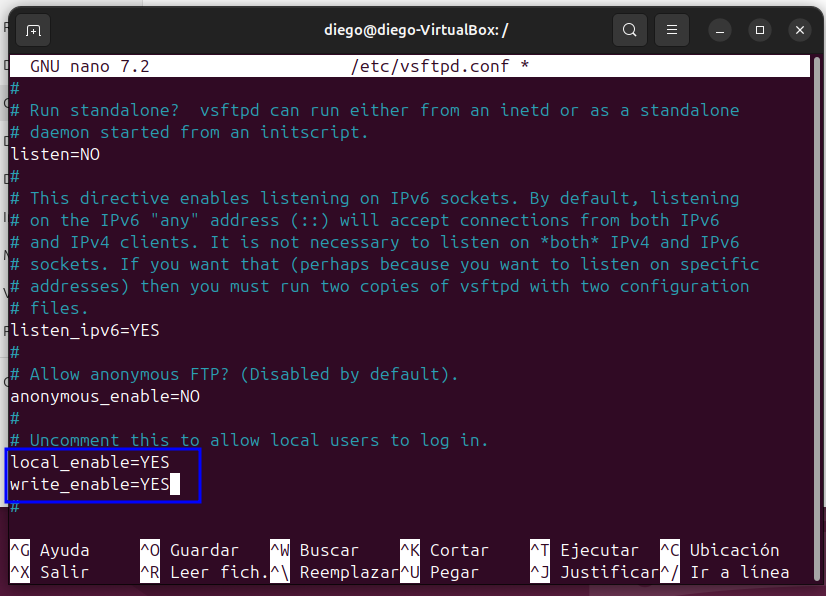
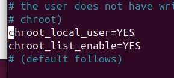

# Filezilla: Gestión de cuentas y agrupaciones

## Generar un grupo con privilegios reducidos
El primer paso consiste en crear un grupo destinado a los usuarios que utilizarán el servicio FTP:  
`sudo groupadd grupoFTP`.  

Este grupo permitirá administrar permisos de forma conjunta para todos sus miembros.

## Preparar el directorio principal del FTP
Seguidamente creamos la carpeta que actuará como directorio inicial para el grupo:  
`sudo mkdir -p /srv/ftp/grupoFTP`.  

Luego asignamos la propiedad del grupo:  
`sudo chown root:grupoFTP /srv/ftp/grupoFTP`  
y aplicamos permisos restringidos:  
`sudo chmod 750 /srv/ftp/grupoFTP`.  

Interpretación de los permisos:
- **root:** lectura, escritura y ejecución  
- **grupoFTP:** lectura y ejecución  
- **otros usuarios:** sin acceso

## Añadir usuarios vinculados al grupo
Ahora incorporamos dos cuentas que utilizaremos en la práctica:

- **Usuario 1**  
  `sudo useradd -m -G grupoFTP -d /srv/ftp/grupoFTP usuario1`  
  `sudo passwd usuario1`  
  Contraseña: Aula17++  

- **Usuario 2**  
  `sudo useradd -m -G grupoFTP -d /srv/ftp/grupoFTP usuario2`  
  `sudo passwd usuario2`  
  Contraseña: Aula17++  

Con esto los usuarios quedan asociados a `grupoFTP` y comparten el mismo directorio raíz.

## Ajustar permisos de escritura y eliminación
En este punto editamos el archivo de configuración de **vsftpd** para habilitar operaciones como subir, borrar o modificar archivos.  

Debe aparecer algo así:

Tambien esto hace que los usuarios locales queden encerrados en su directorio personal cuando se conectan por FTP.

Estas opciones permiten:
- Cargar archivos al servidor  
- Eliminar elementos  
- Editar contenido existente

## Limitar conexiones simultáneas
A continuación configuramos un límite de acceso: máximo 10 conexiones totales y un máximo de 2 por dirección IP.

`max_clients=10`  
`max_per_ip=2`

## Verificaciones finales
Comprobamos que el grupo y los usuarios existen:  
`getent group grupoFTP`.  

## Diferencias entre permisos de usuario y de grupo
Los **permisos individuales** determinan qué puede hacer un usuario concreto sobre un archivo o carpeta (leer, modificar, eliminar). Permiten un control detallado sobre cada cuenta.

Los **permisos de grupo** se aplican a todos los miembros de un mismo conjunto, facilitando la administración cuando varios usuarios requieren los mismos privilegios. En entornos FTP, esto simplifica la gestión y evita configuraciones repetitivas.
