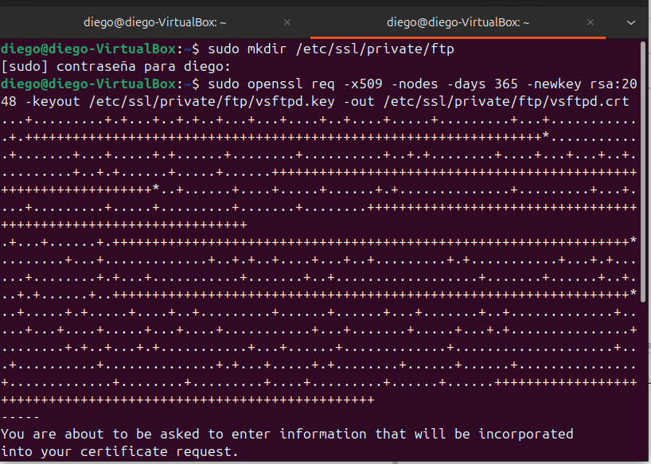
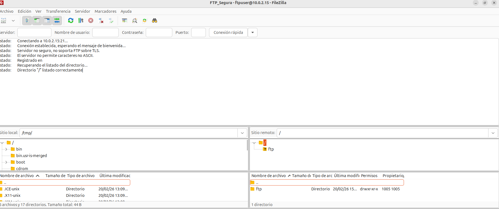

# FileZilla: Configuración de FTP Seguro (FTPS)

## Creación de un certificado TLS

Generamos un certificado autofirmado para habilitar FTPS:

sudo mkdir /etc/ssl/private/ftp
sudo openssl req -x509 -nodes -days 365 -newkey rsa:2048 -keyout /etc/ssl/private/ftp/vsftpd.key -out /etc/ssl/private/ftp/vsftpd.crt
Protegemos la clave privada con permisos restrictivos:

sudo chmod 600 /etc/ssl/private/ftp/vsftpd.key

---

## Configuración de vsftpd para FTPS explícito

Editamos el archivo principal de configuración:

sudo nano /etc/vsftpd.conf

Y nos aseguramos de que contenga las directivas necesarias.

---

## Reinicio del servicio

Aplicamos los cambios reiniciando **vsftpd**:

sudo systemctl restart vsftpd
sudo systemctl status vsftpd

El servicio debe aparecer como **active (running)**.

---

## Creación de un usuario FTP de prueba

Generamos un usuario local específico:

sudo adduser ftpuser

Luego, creamos un directorio dedicado y asignamos permisos:

sudo mkdir -p /home/ftpuser/ftp
sudo chown ftpuser:ftpuser /home/ftpuser/ftp

Esto permitirá que el usuario tenga acceso controlado al FTP.

---

## Conexión desde FileZilla Client

Abrimos FileZilla Client y configuramos una nueva conexión con los datos del servidor FTPS:  

Al conectarnos, FileZilla mostrará indicaciones de cifrado, confirmando que la sesión se establece mediante FTP explícito sobre TLS:  

---

## Conclusión

Se realizaron pruebas con FileZilla Client conectándose a un servidor FTP seguro.  
La conexión se configuró con IP, usuario `ftpuser` y contraseña, asegurando que la transmisión de datos se realizara cifrada.  

La ventana de estado de FileZilla permitió comprobar la secuencia de comandos
