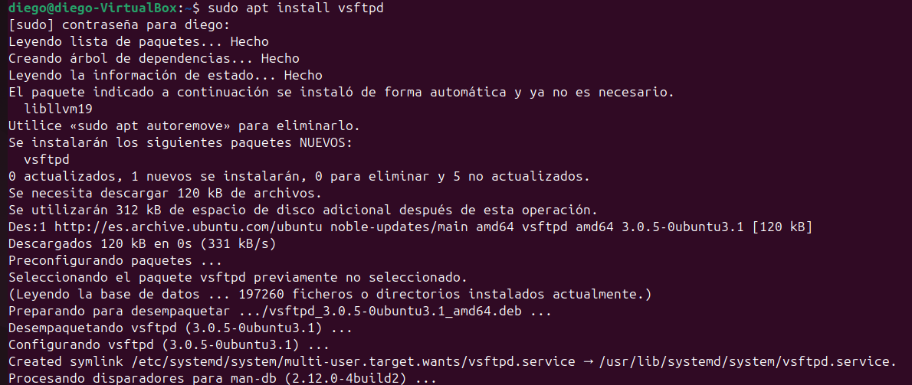
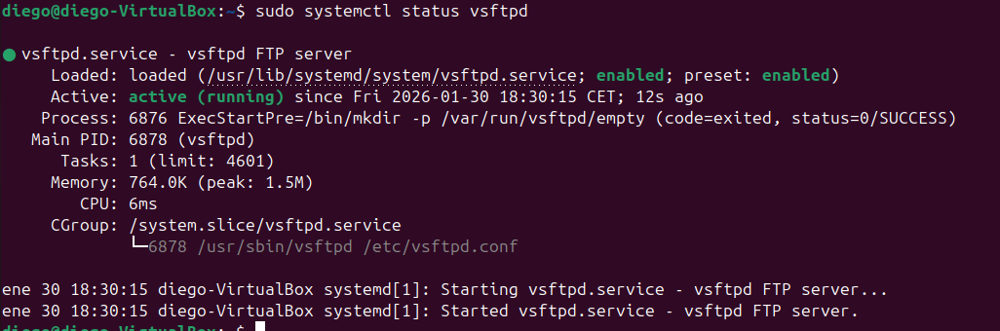
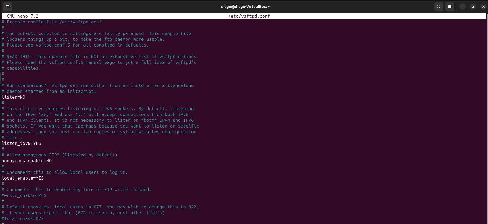
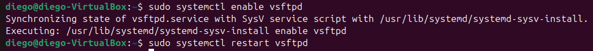
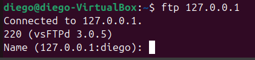

# 📂 FileZilla: instalación y configuración básica del servidor FTP

## 1. Instalación del servicio FTP (vsftpd)
Para comenzar, instalamos el servidor FTP ejecutando:

---

## 2. Verificación del estado del servicio
Una vez instalado, comprobamos que el servicio se encuentra activo con:

Si el estado aparece como **active (running)**, significa que el servidor está funcionando correctamente.

---

## 3. Acceso a la configuración del servidor
En sistemas Linux, la administración se realiza mediante archivos de configuración.  
El archivo principal es:

`sudo nano /etc/vsftpd.conf`

---

## 4. Comprobación del puerto de escucha
Por defecto, el protocolo FTP utiliza el **puerto 21**, por lo que solo debemos asegurarnos de que esté configurado correctamente en el archivo de configuración.

---

## 5. Obtener la dirección IP del servidor
El servidor escucha en todas las interfaces por defecto.  
Para conocer la IP de la máquina, ejecutamos:

`ip a`

Esta dirección será la que utilice el cliente FTP para conectarse.

---

## 6. Activar el arranque automático
Configuramos el servicio para que se inicie junto al sistema:
Después aplicamos los cambios reiniciando el servicio:

---

## 7. Comprobar que el puerto está abierto
Verificamos que el servidor está escuchando en el puerto 21 con:

---

## 8. Probar la conexión
Para asegurarnos de que el servidor responde correctamente, ejecutamos:

`ftp IP_DEL_SERVIDOR`

En este caso:

`ftp 127.0.0.1`

Si solicita usuario y contraseña, el servidor está funcionando.

---

## 9. Conclusión
En esta práctica se ha realizado la instalación y configuración inicial de un servidor FTP en Ubuntu usando **vsftpd**. Se verificó su funcionamiento, su arranque automático, el puerto de escucha y la IP del sistema, confirmando que el servicio acepta conexiones correctamente.
