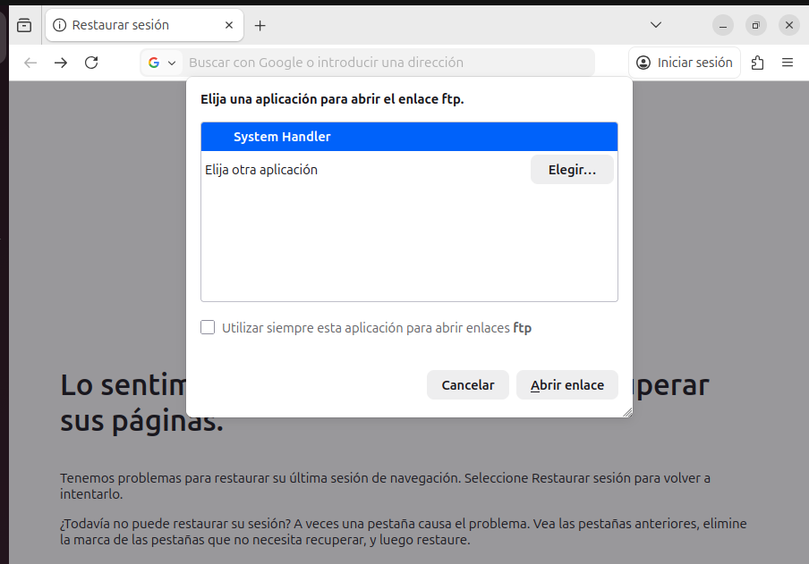

# Análisis del Navegador como Cliente FTP

## 1. Test de Conectividad mediante Navegador

Se procedió a testear el acceso al servidor local a través de **Mozilla Firefox** empleando la siguiente URL:

`ftp://127.0.0.1:2121`

### Resultado de la inspección:

**Diagnóstico técnico:**
* **Falta de soporte TLS:** El servidor requiere **FTPS explícito**, un protocolo de seguridad que los navegadores modernos han dejado de implementar de forma nativa.
* **Delegación de protocolo:** En sistemas actuales (especialmente en entornos Linux), el navegador no gestiona el tráfico FTP por sí mismo, sino que intenta invocar una aplicación externa del sistema operativo.

---

## 2. Comparativa: Navegador Web vs. Software Especializado

| Prestación | Navegador Web | Cliente Dedicado (FileZilla / WinSCP) |
| :--- | :---: | :---: |
| **Cifrado (FTPS/TLS)** | ❌ No compatible | ✅ Soporte total |
| **Subida de archivos** | ❌ Muy limitada | ✅ Funcionalidad completa |
| **Gestión de directorios** | ❌ Solo lectura (frecuentemente) | ✅ Creación y subida recursiva |
| **Control de flujo** | ❌ Sin colas de espera | ✅ Gestión de colas y prioridad |
| **Persistencia** | ❌ No reanuda descargas | ✅ Reanudación automática (Resume) |
| **Modos de conexión** | ❌ Configuración cerrada | ✅ Selección de modo Activo/Pasivo |
| **Monitorización** | ❌ Interfaz opaca | ✅ Registro de comandos (Logs) |

---

## 3. Puntos Fuertes (Ventajas)
* **Accesibilidad inmediata:** No requiere la instalación de binarios adicionales para consultas rápidas.
* **Consumo de recursos:** Útil para descargas ligeras en servidores públicos sin autenticación compleja.

## 4. Puntos Débiles (Inconvenientes)
* **Inseguridad:** Al no soportar SFTP o FTPS, la transferencia suele ser vulnerable.
* **Operatividad nula:** Incapacidad para subir estructuras de carpetas o editar permisos de archivos.
* **Dependencia externa:** Necesidad de configurar "Mime Types" o aplicaciones de terceros para funcionar.

---

## 5. Valoración Técnica

La prueba demuestra que, aunque el navegador puede actuar como un visor de archivos rudimentario, **es totalmente insuficiente para entornos de producción** que exijan seguridad (TLS) o gestión avanzada de datos. Para un flujo de trabajo profesional, el uso de herramientas como **FileZilla** es imperativo para garantizar la integridad y el cifrado de la información.
