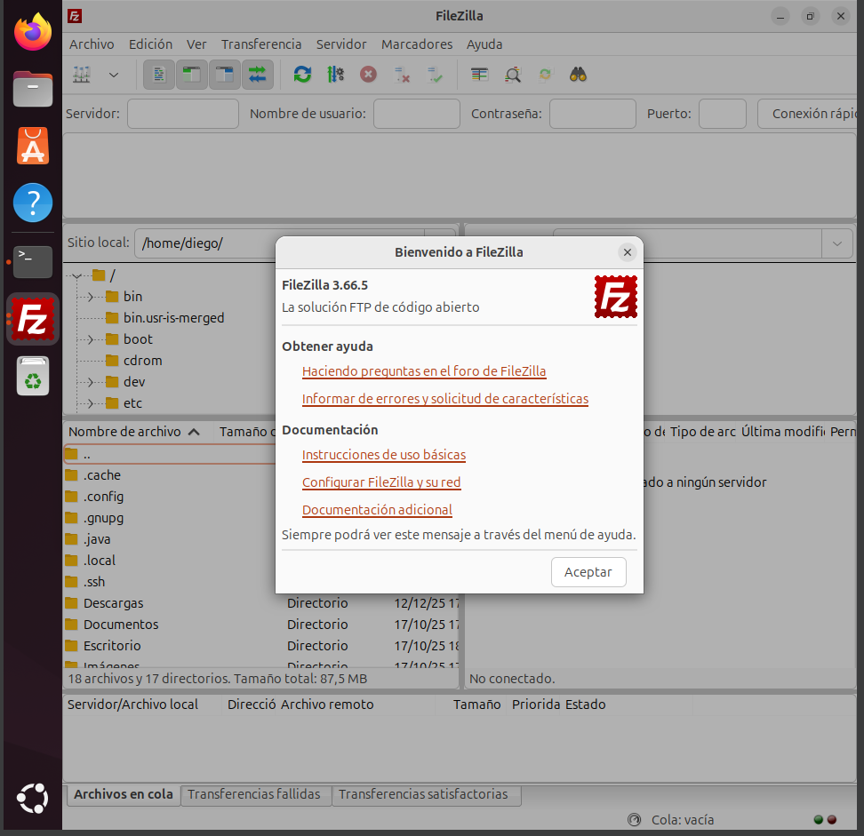
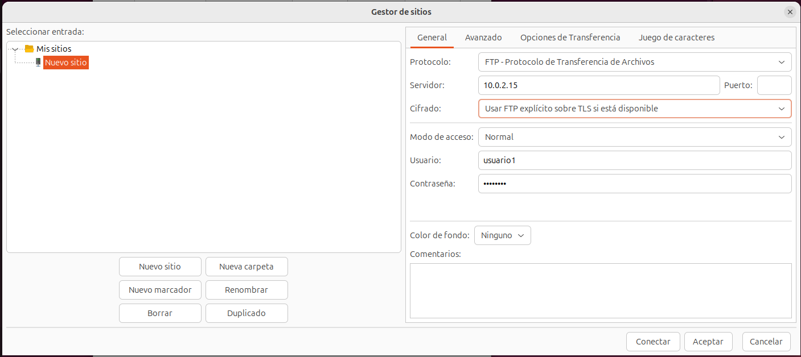
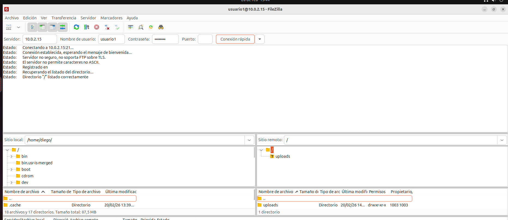

# 📂 FileZilla: Comprobaciones con Cliente Gráfico

## 1. Instalación de FileZilla en Ubuntu

Si no disponemos del cliente instalado, lo primero será actualizar los repositorios después instalamos el programa:

`sudo apt install filezilla`

Una vez completada la instalación, lo ejecutamos con:

`filezilla`

Al iniciarse, veremos la interfaz principal del cliente gráfico.

---

## 2. Creación de una conexión en el Gestor de sitios

Para guardar los datos de conexión abrimos:

**Archivo → Gestor de sitios → Nuevo sitio**

Configuramos los siguientes parámetros:

.  
Si la conexión es correcta, se mostrará el contenido del servidor en el panel remoto.

---

## 3. Transferencia de archivos en ambos sentidos

### 🔹 Envío de archivos al servidor
Seleccionamos un archivo en el panel local y lo arrastramos al directorio remoto.  

En la parte inferior aparecerán mensajes como:

