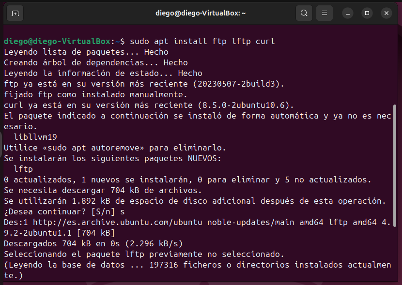
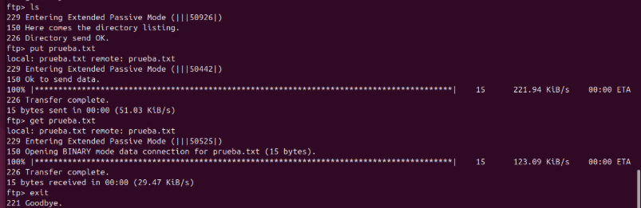
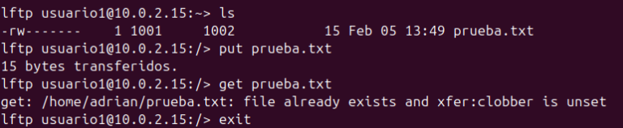
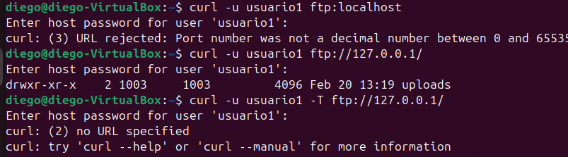

# 📂 FileZilla: Verificación con Clientes FTP en Consola

## 1. Verificar que el servicio FTP está en ejecución

Antes de comenzar, comprobamos que el servicio esté funcionando correctamente:

`sudo systemctl status vsftpd`

---

## 2. Instalación de herramientas cliente

Aunque muchas distribuciones ya incluyen el cliente `ftp`, instalamos las utilidades necesarias para asegurarnos:

Con esto tendremos disponibles distintos clientes para realizar pruebas desde la terminal.

---

## 3. Creación de un archivo de prueba

Generamos un fichero sencillo para probar la subida al servidor:

`echo "Archivo de prueba desde terminal" > prueba.txt`

Este archivo servirá para comprobar tanto subida como descarga.

---

## 4. Pruebas con distintos clientes

### 🔹 A) Cliente `ftp` (tradicional)

Conectamos al servidor:

`ftp 10.0.2.15`

Después de autenticarnos, podemos ejecutar:

- Listar contenido: `ls`
- Subir archivo: `put prueba.txt`
- Descargar archivo: `get prueba.txt`
- Cerrar sesión: `exit`

---

### 🔹 B) Cliente `lftp`

Establecemos conexión indicando el usuario:

`lftp usuario1@10.0.2.15`

Una vez dentro:

- Ver archivos: `ls`
- Enviar archivo: `put prueba.txt`
- Descargar archivo: `get prueba.txt`
- Salir: `exit`

`lftp` ofrece una interfaz más avanzada y flexible que el cliente básico.

---

### 🔹 C) Cliente `curl`

También podemos realizar operaciones FTP con `curl`:

- Listar archivos:
  `curl -u usuario1 ftp://10.0.2.15/`

- Subir archivo:
  `curl -u usuario1 -T prueba.txt ftp://10.0.2.15/`

- Descargar archivo:
  `curl -u usuario1 -O ftp://10.0.2.15/prueba.txt`

---

## 5. Resultado de las pruebas

Durante las pruebas con `curl` apareció inicialmente el error **530 (Access denied)**, provocado por credenciales incorrectas.  

Tras especificar correctamente el usuario con `-u` e introducir la contraseña adecuada, se pudieron realizar todas las operaciones sin problemas: listado, subida y descarga de archivos desde la línea de comandos.

En conclusión, los tres clientes permiten interactuar correctamente con el servidor FTP, cada uno con diferentes niveles de funcionalidad y flexibilidad.
