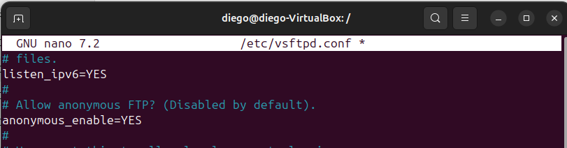
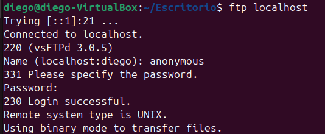

# 📂 Configuración de Acceso FTP Anónimo con FileZilla

## 1. ¿En qué consiste el acceso anónimo en FTP?
El acceso anónimo en un servidor FTP permite que cualquier usuario pueda conectarse sin credenciales personales, utilizando el usuario `anonymous` o `ftp`.  

Este tipo de acceso suele emplearse únicamente para permitir la descarga de archivos públicos. Por razones de seguridad, no se conceden permisos para subir, modificar ni eliminar contenido.

---

## 2. Creación del directorio destinado a usuarios anónimos
Primero creamos una carpeta específica para este tipo de acceso:

`sudo mkdir -p /srv/ftp/publico`

Después asignamos el propietario y grupo correspondientes:

`sudo chown ftp:ftp /srv/ftp/publico`

A continuación, establecemos permisos exclusivamente de lectura y ejecución:

`sudo chmod 555 /srv/ftp/publico`

El valor `555` implica:
- Permiso de lectura para todos los usuarios.
- Permiso de ejecución (necesario para acceder al directorio).
- Ningún permiso de escritura, evitando cambios en el contenido.

---

## 3. Creación de un archivo de prueba
Creamos un archivo visible para comprobar el funcionamiento:

`sudo nano /srv/ftp/publico/INFO.txt`

Ejemplo de contenido:
> Servidor FTP con acceso anónimo habilitado únicamente en modo lectura.

Luego ajustamos sus permisos:

`sudo chmod 444 /srv/ftp/publico/INFO.txt`

El permiso `444` permite solo la lectura del archivo.

---

## 4. Configuración del servidor vsftpd
Editamos el archivo de configuración:

`sudo nano /etc/vsftpd.conf`

Añadimos o verificamos las siguientes directivas:

Con esta configuración:
- Se activa el acceso anónimo.
- Se define el directorio raíz específico para estos usuarios.
- Se bloquea cualquier operación de escritura o modificación.

---

## 5. Prueba de conexión
Desde el cliente ejecutamos:

`ftp 10.0.2.15`

Accedemos sin introducir usuario específico y comprobamos:
- Se puede listar el contenido del directorio.
- Se puede descargar el archivo de prueba.
- No es posible subir ni modificar archivos debido a la restricción de permisos.

La prueba confirma que el acceso está correctamente limitado a lectura.

---

## 6. Resultado final
En esta práctica se ha habilitado el acceso anónimo en un servidor FTP mediante **vsftpd**, restringiendo el entorno a un directorio concreto y permitiendo únicamente la visualización y descarga de archivos.  

Las restricciones impuestas impiden cualquier tipo de modificación, subida o eliminación de contenido, garantizando así un entorno seguro para la distribución pública de archivos.
